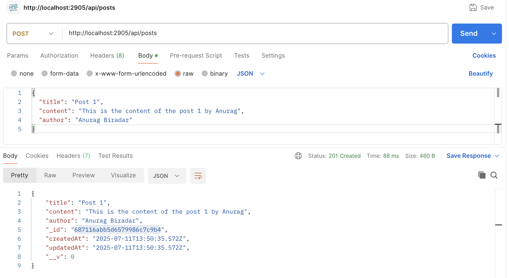
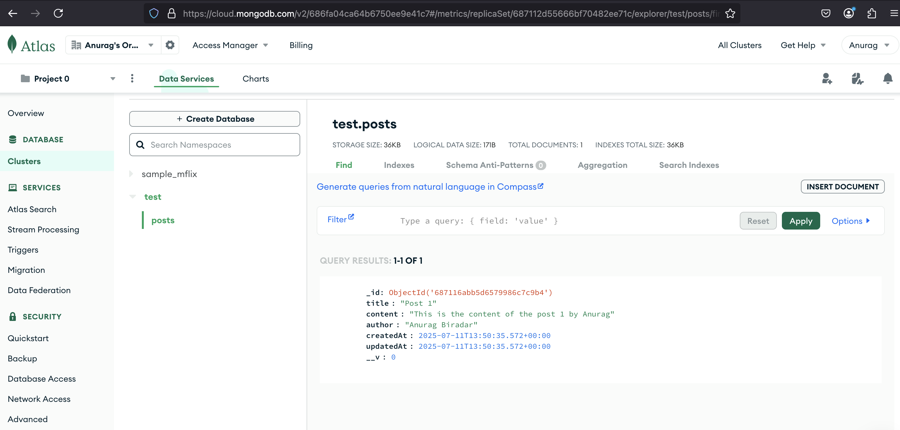

# 📝 TypeScript + Express + MongoDB CRUD API

A RESTful CRUD API built with **TypeScript**, **Node.js**, **Express**, and **MongoDB** using **Mongoose**. This project demonstrates clean project structure, error handling, and connection to a cloud-hosted MongoDB Atlas database.

---

## 🚀 Features

- TypeScript support with Node.js
- CRUD operations for blog posts
- MongoDB Atlas or local MongoDB support
- Express-based API routing
- Environment-based configuration
- Ready for deployment

---

## 📦 Technologies Used

- Node.js
- TypeScript
- Express
- MongoDB + Mongoose
- dotenv

---

## 🔧 Setup Instructions (Local Development)

### 🚀 Clone the Repository

```bash
git clone https://github.com/anuragbiradar2305/ts-mongo-crud.git
cd ts-mongo-crud
```

### Install Dependencies

npm install

### create.env file and update details

Create .env File from .env.example
(Replace MONGO_URI with your local MongoDB or Atlas URI (i used Atlas here for this project) setup can be done like below.

### MongoDB Atlas Setup

If you prefer to use MongoDB Atlas instead of local MongoDB:
✅ Steps:

    Go to MongoDB Atlas and sign in.

    Create a new project and a free cluster.

    In Database Access, create a new user with  password.

    In Network Access, allow access from your IP (0.0.0.0/0 for development).

    Click Connect → Connect Your Application and copy the connection string.

### Run the App

npm start

### 📬 API Endpoints

**Base URL:** `/api/posts`

| Method | Endpoint       | Description       |
| ------ | -------------- | ----------------- |
| GET    | /              | Root route        |
| GET    | /api/posts     | Get all posts     |
| GET    | /api/posts/:id | Get a single post |
| POST   | /api/posts     | Create a new post |
| PUT    | /api/posts/:id | Update a post     |
| DELETE | /api/posts/:id | Delete a post     |

## Screenshots

### Postman API Request for POST Method



### Document Successfully Created in Atlas Cloud


